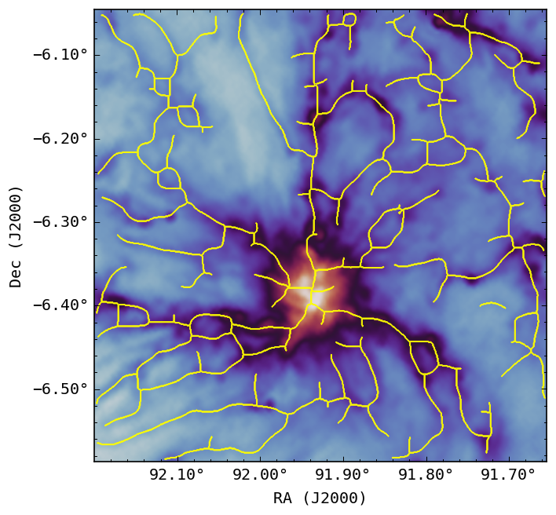
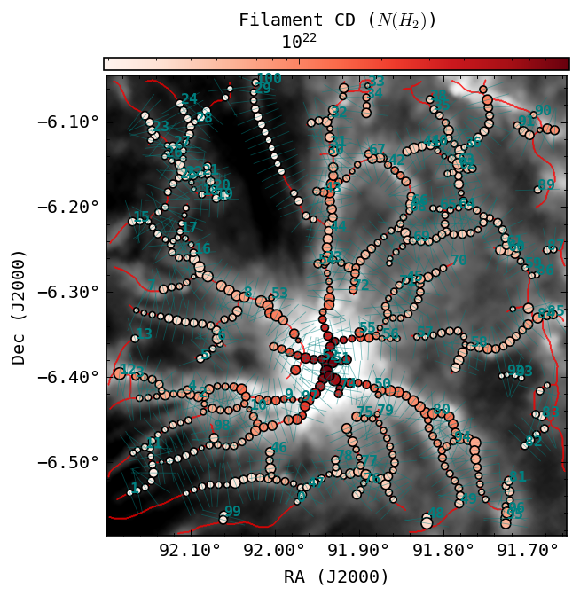
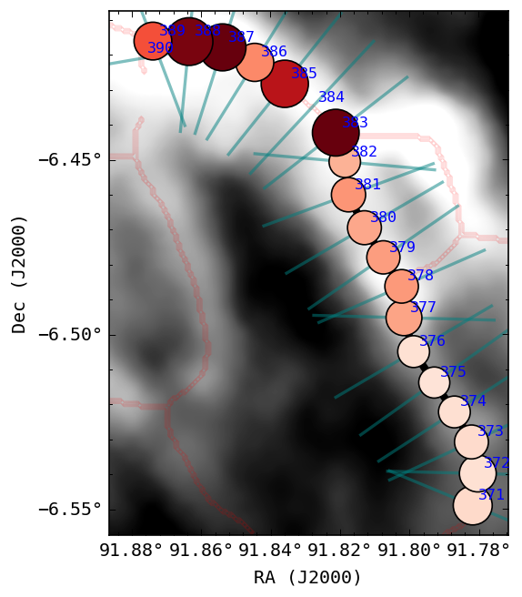
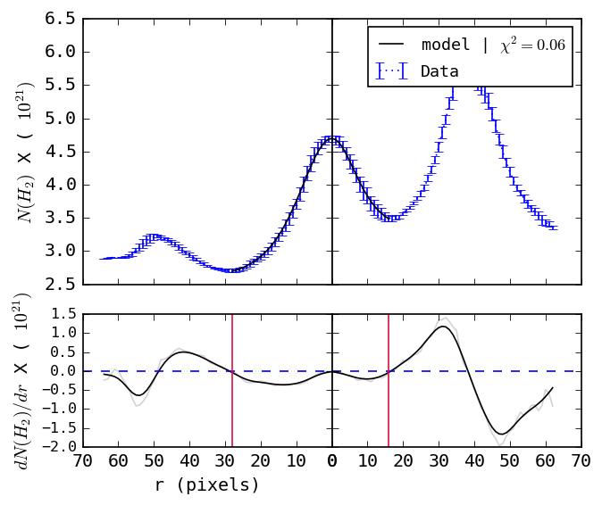

# SUTRA : Filaments in the ISM
_Filament identificaiton and characterisation framework_

---

The package can be used as a standalone web application or can be imported as Python library

## Installation


```bash
git clone https://git.sac.gov.in/destiny_doom/sutra.git 
cd sutra
pip install .

```
Note : we recommend creating a new conda environment before installation and make sure that current `pip` is coming from conda environment

```bash
conda create -n <environment-name>
conda activate <environment-name>
which pip
```

verify installation using following command:

```bash
sutraWeb
```

## Web Application: 

The streamlit based web application runs with the following command from anywhere in the terminal

```bash
sutraWeb
```

## Command Line Application

```bash
sutraTracer -c <path/to/column/density/map> -s <output-skeleton-map-file-name> -p
```

#### CLI options

```
options:
  -h, --help            show this help message and exit
  -c INPUT_FILE, --cd_file INPUT_FILE
                        Path to the input Column density map file.
  -s SKL_OUTPUT_FILE, --skl_output SKL_OUTPUT_FILE
                        Path to the output Skeleton map.
  -p MODEL_OUTPUT_FILE, --model_output MODEL_OUTPUT_FILE
                        Path to the output Skeleton map.
  -t THRESHOLD, --threshold THRESHOLD
                        Threshold to convert model output to skeleton map
  -m MODEL, --model MODEL
                        Dictionay key-name storing the path to trained model weights

```


## Using Sutra as Python package

### Import Sutra

```python
from sutra.tracer.predictor import filamentIdentifier as FID
from sutra.measurement import local_field as LF
```
### Create Crest probability map using trained model

```python
monr2_crop = fits.open('<cd-fits-file>')
```

```python
prob_map = FID('HGBS').predict(monr2_crop[0], window_overlap_frac = 0.95, batch_size = None, n_jobs = 1)
```
```python

meta_info = {
                'distance' : 830, # 140 pc for Taurus , 260 for musca
                'beam' : 36.4 , # arcsec 
                'radial-cutoff' : 0.6 , 
            } 
```

### Skeletonize the probability map

```python
from sutra.profilerV2.prob2skl import run_skel
th_max = 0.45
beam_size = 12
skel = run_skel(prob_map, th_max = th_max, bkg_mask=None, beam_size=12, prune = True, convolve_map=True)

```


    
### Use Skeleton for measuring filament properties

```python
from sutra.profilerV2.radprof import RadProf
monr2aprof = RadProf(monr2_crop[0], skel, meta_info=meta_info)
monr2aprof.tangents(ks = 3, stride=2) # create radial cuts
monr2aprof.reorder() # give location based ordering to each radial profiles
monr2aprof.spline_smooth() # smoothens the skeleton spine using Bezier curves
monr2aprof.cut_off_points(alpha_pc=1.5) #cutoff-distance in parsec
monr2aprof.create_rad_profile_single_thread() # Extract all filament profiles and store in monr2Prof.beam_dict['beam_elements']
```


```python
monr2aprof.group_profiles() # Group profiles together in beam elements
monr2aprof.get_all_beam_props() # Compute beam level properties
```

### Properties Map

```python
monr2aprof.plot_props(sizescale=0.5, sizeby='Wbg', show_filid=True, red_chi_filter=5, colorby='Nfil')
```


### Plot a selected Filament

```python
monr2aprof.plot_filament(49, sizescale=10, red_chi_filter=5, sizeby='Wbg', show_beamid=True)
```


### Inspect the Radial profile fit of selected beam

```python
monr2aprof.beam_dict['beam_elements'][374].plot_plummer()
```


### Access the Properties map data-table
```python
monr2aprof.beamProps
```
